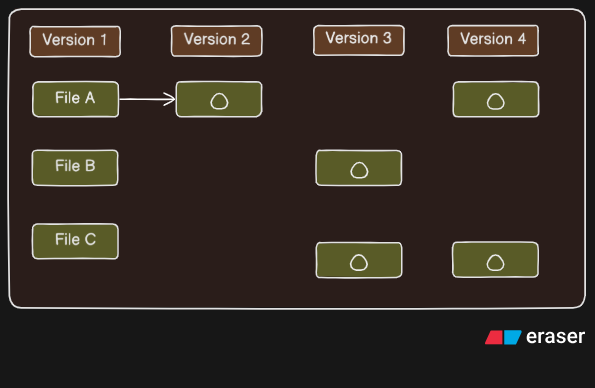

## What is Git ?

#### Snapshots and No Differences

The difference between other VCS(version control system) is the way git thinks. These other systems think of information as list of file changes.
Like they store as a set of files and the changes made to each file over time.

Checkins Over Time---------

The image above shows the functions of other VCS systems how they store changes in files with them.
These other systems think of the information as a set of files and the changes made to each file over time.

Here you will the triangles inside boxes for each File They are only save of the changes are made on them.

#### To Install Git

Go to [Git](https://git-scm.com/downloads) website to install git your system

