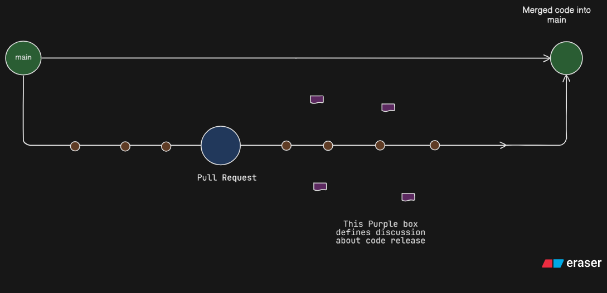

<h1>Git and Github</h1>

<h3>Git</h3>

Git is a version control system that intelligently tracks changes in files. Git is particularly useful when you and a group of people are all making changes to the same files at the same time.

<h3>Github</h4>

GitHub is a cloud-based platform where you can store, share, and work together with others to write code.

#### Why Git and Github

* Version control is a system that records changes to a file or set of files over time so that you can recall specific versions later.
* Basically Git is a distributed version control system for tracking changes in files.
* Version control is basically a system that records changes to a file or set of files over time so that you can recall specific versions later. And distributed means that complete codebase including its full version history is mirrored on every developer's computer.
* Git is a distributed version control system designed to track changes in source code during software development. It enables multiple developers to work on a project simultaneously without interfering with each other's work.

Why use git?

### To Create Account on Github (Follow steps)

1. Navigate to [Github](https://github.com)
2. Click Sign up
3. Alternatively, click on **Continue with Google** to sign up using social login.
4. Follow the prompts to create your personal account.

#### Create a repository

1. In your upper right corner your account logo click on that you will have an option to create a new repository or just in your profile you will have bars there should be written Overview , Repository
2. Click on repository and create new repository.
3. In the "Repository name" box, type `hello-world`.
4. In the "Description" box, type a short description. For example, type "This repository is for practicing the GitHub Flow."
5. Select ​**Add a README file**​.
6. Click ​**Create repository**​.

#### Create a Branch

Branching lets you have different versions of a repository at one time.
By default, your repository has one branch named `main` or `master` that is considered to be the definitive branch. You can create additional branches off of `main` in your repository.

When you create a branch off the `main` branch, you're making a copy, or snapshot, of `main` as it was at that point in time. If someone else made changes to the `main` branch while you were working on your branch, you could pull in those updates.

The diagram shows you the functionality of branches

1. The $\textcolor{green}{Green}$ circle is the `main` branch which has all your production grade code.
2. Then you see a line going below which is a feature branch created with commits and pushes of code, then the feature branch journey ends with the merger of feature branch in main branch with dicussion between team members.

Creating a branch

1. Click the **Code** tab of your `hello-world` repository.
2. Above the file list, click the dropdown menu that says ​**main**​.
3. Type a branch name, `readme-edits`, into the text box.
4. Click ​**Create branch: readme-edits from main**​.

### Conclusion

* Create a repository.
* Start and manage a new branch.
* Change a file and commit those changes to GitHub.

