## Rules to practice and submit your given task

#### Follow the below steps

1. Create account on [Gtihub](https://github.com)
2. See the below image click on that red circle.
   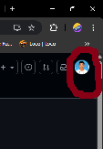
3. You see on clicking upon that image you will see this list open where you will see repositories

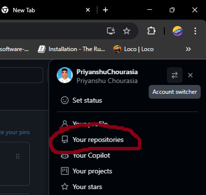

4. Click on Repositories and this window will get opened where New button will there
   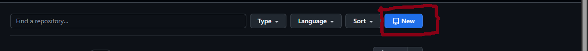
5. After clicking on New you will get the window below
   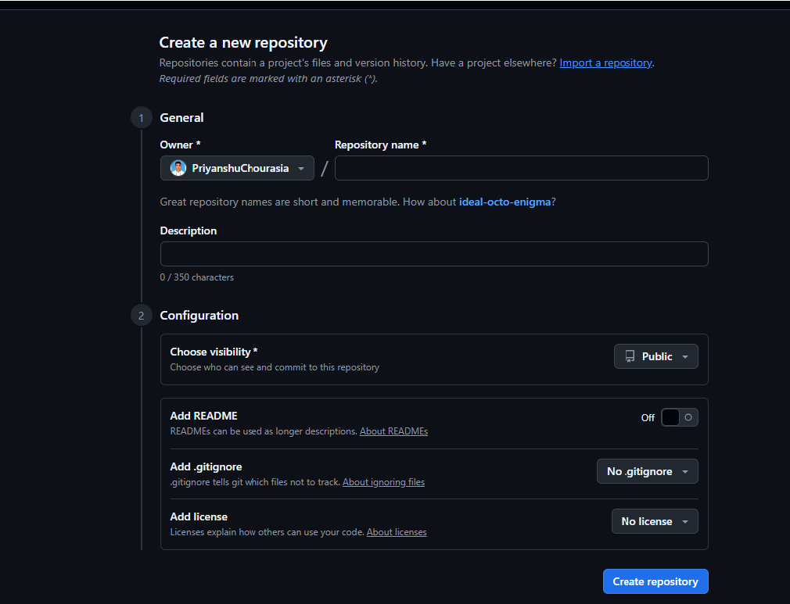
6. After getting this window write your repository name and click on Create Repository Button.
7. One repository will be created and you can see those repository in your profile.

#### To run git in your local machine you need to install git in your own local PC or Laptop

##### To install Git to your local machine

* [Git Install](https://git-scm.com/downloads) --- Go to this link and install git of windows
* You are going to get the below window and now please install according to your machine either its linux, macos or windows.
  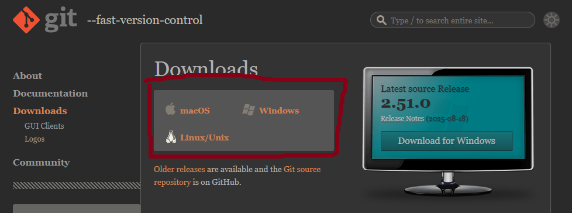
  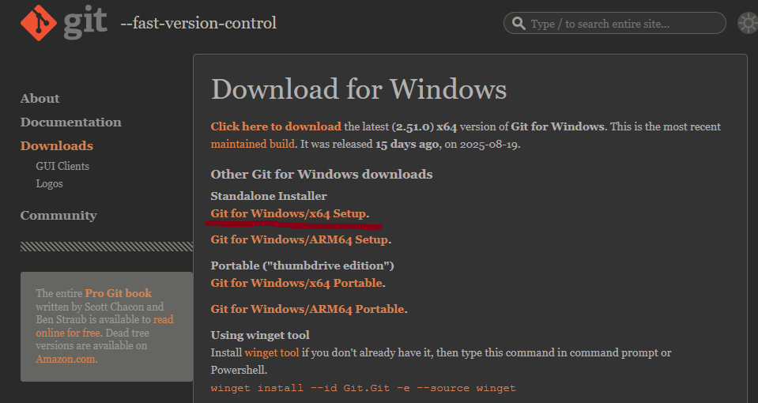
  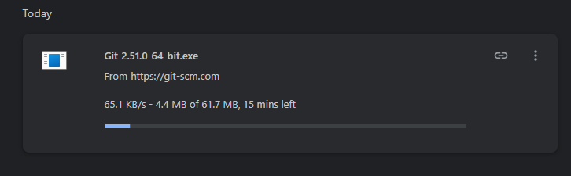
  After downloading double click on that downloaded file then you will get this window.
  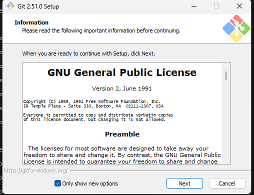
  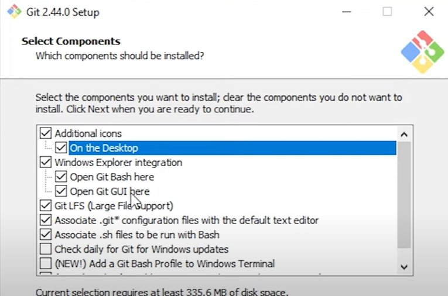
  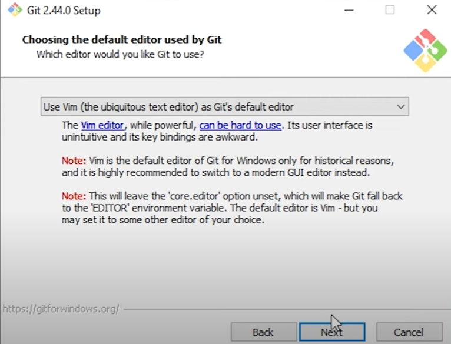
  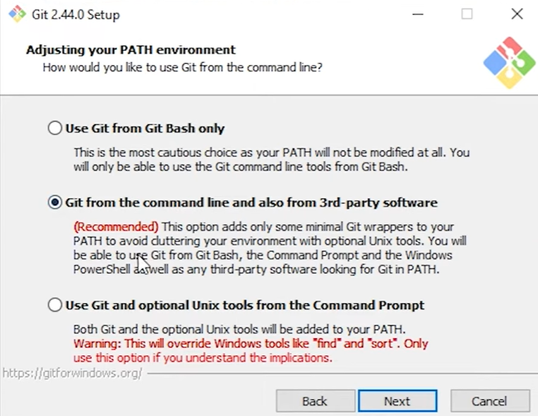
  
  Follow this youtubelink [GithubYoutubeLink](https://www.youtube.com/watch?v=cweFdzKMeS0)
* After installing to please check it is installed or not by running
* git --version in your command prompt
  `git version 2.45.2.windows.1` you should get prompt something like this.

##### After doing all this now lets connect your github account to your local account.

### Rules to complete your excercises

1. Follow the above steps to create your Github account
2. Create your own Repository named IntroToGithub
3. Complete every given question and submit your github link in the whatsapp group or if you are not in our whatApp group then mail your github link to  `samir007@gmail.com`

